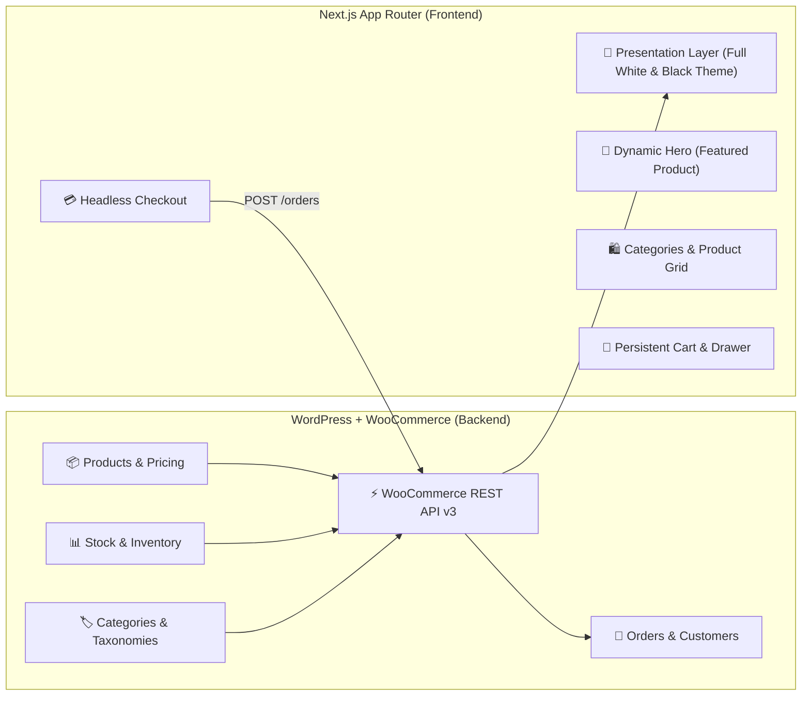

# INTERSTING — Headless WooCommerce & Next.js Architecture Guide

> **Core Philosophy:** **99% of all business logic resides strictly inside WordPress & WooCommerce.**  
> The Next.js frontend is a pure, lightning-fast presentation and shopping layer. Whatever you add, update, or remove in your WordPress Admin (`http://interesting.local/wp-admin`) instantly drives the website.

---

## 1. System Architecture Overview



---

## 2. Managing Your Business Logic in WordPress

Every aspect of your e-commerce store is controlled directly from your WordPress dashboard:

### 2.1 Products & Pricing
- **Add / Edit / Delete Products:**  
  Go to **WordPress Admin → Products → All Products / Add New**.
- **Regular & Sale Price:**  
  Set the **Regular price** and **Sale price** in the Product Data box. If a sale price is set, Next.js automatically calculates and displays the exact percentage discount badge (e.g., `15% OFF`).
- **Product Descriptions:**  
  - **Main Description:** Shows on the dedicated product detail page (`/product/[slug]`).
  - **Short Description:** Displays on the product cards and summary snippets.
- **Product Images:**  
  Upload the **Product image** and **Product gallery** in the right sidebar. Next.js pulls and optimizes these images directly.

### 2.2 Featured Products (Hero Section)
- In **Products → All Products**, click the **Star (★)** icon next to any product to mark it as **Featured**.
- The Next.js homepage Hero Banner automatically features that product dynamically (showing its title, price, image, and direct link).

### 2.3 Categories
- Go to **Products → Categories**.
- Any category you create (e.g., *Nuts & Kaju, Super Seeds, Dry Fruits*) appears automatically in the top navigation category bar.
- Upload a thumbnail image for the category in WordPress to customize its circular navigation icon.

### 2.4 Stock & Inventory Management
- In product settings, under **Inventory**:
  - Set **Stock status** to *In stock* or *Out of stock*.
  - When set to *Out of stock*, the Next.js add-to-cart button automatically changes to **"Sold Out"** and disables ordering.
  - Enable **Manage stock** to track exact inventory quantities.

### 2.5 Customer Orders
- When a customer checks out on the Next.js site, the frontend issues a `POST /wp-json/wc/v3/orders` request to WooCommerce.
- The order instantly appears in **WooCommerce → Orders** with:
  - Customer billing & shipping address
  - Line items, quantities, and line totals
  - Payment method (e.g., Cash on Delivery / UPI)
  - Order status set to `processing` or `pending`

---

## 3. Themes: Full White & Black Theme

The application features a minimalist monochrome design system supporting both **Full White Theme** and **Black Theme**:

| Element | Full White Theme (Default) | Black Theme (Dark Mode) |
|---|---|---|
| **Background** | Crisp Pure White (`#ffffff`) | Deep Black (`#000000`) |
| **Surface Cards** | White with subtle neutral border (`#e5e7eb`) | Charcoal Black (`#0c0c0e`) with border (`#27272a`) |
| **Typography** | Deep Charcoal (`#111827`) & Slate (`#4b5563`) | Bright White (`#f4f4f5`) & Zinc (`#a1a1aa`) |
| **Primary Buttons** | Contrast Solid Black with White text | Contrast Solid White with Black text |
| **Toggle** | One-click button in Header (☀️ / 🌙) | Remembers choice in `localStorage` |

---

## 4. How Changes in WordPress Reflect on the Website

### Development Mode (Current):
- In development, API calls are configured with `cache: 'no-store'`.
- Whenever you update a price, product title, image, or category in WordPress, simply **refresh your browser** to see the changes immediately.

### Production Deployment:
- Next.js uses **Incremental Static Regeneration (ISR)** with periodic revalidation (e.g., 60 seconds).
- **Instant On-Demand Revalidation:** You can configure a WooCommerce Webhook (`product.updated`, `product.created`, `order.created`) that hits a Next.js revalidation route (`/api/revalidate`) to purge the cache instantly when you save changes in WordPress.

---

## 5. Project Directory Architecture

```
intersting-app/
├── app/
│   ├── page.tsx                  ← Dynamic Homepage (Hero, Categories, Products)
│   ├── layout.tsx                ← Root Layout (ThemeProvider, CartProvider, Header, Footer)
│   ├── globals.css               ← Full White & Black Theme CSS Tokens
│   ├── shop/page.tsx             ← Shop Catalog with Category & Search Filters
│   ├── product/[slug]/page.tsx   ← Product Details & Server-rendered attributes
│   ├── cart/page.tsx             ← Full Shopping Cart Page
│   ├── checkout/page.tsx         ← Headless Checkout sending orders to WooCommerce
│   └── account/page.tsx          ← Customer Portal linked to WooCommerce My Account
├── components/
│   ├── layout/                   ← AnnouncementBar, Header, Footer
│   ├── product/                  ← HeroBanner, CategoryBar, ProductCard, ProductGrid, TrustBadges
│   ├── cart/                     ← CartDrawer, FloatingCartBar
│   └── ui/                       ← ThemeToggle, Button, Badge, QuantitySelector
├── lib/
│   ├── api/
│   │   ├── client.ts             ← Base WooCommerce REST API fetch client
│   │   ├── products.ts           ← Product & category data fetching functions
│   │   └── orders.ts             ← Order creation endpoint
│   └── utils/formatters.ts       ← Currency formatting (INR), HTML stripping, calculations
├── store/
│   ├── CartContext.tsx           ← Persistent Cart Context with localStorage sync
│   └── ThemeContext.tsx          ← White & Black Theme Provider
└── types/                        ← Strict TypeScript interfaces matching WooCommerce REST API
```

---

## 6. Environment Configuration

Your `.env.local` contains the secure credentials to connect with your local WordPress installation:

```env
# WooCommerce Site URL
NEXT_PUBLIC_WC_URL=http://interesting.local

# WordPress Application Password (recommended for LocalWP)
WC_APP_USER=ashok
WC_APP_PASSWORD=G4J1 hiEc rSBt ALs7 Ftyh 6mBf

# Consumer Key & Secret (Fallback)
WC_CONSUMER_KEY=ck_41bc01e3bd8cbef7ab775b9fed136778b1efd727
WC_CONSUMER_SECRET=cs_3b1595d0742b1850ed73df5cd4f8e3405e1212ad
```

---

## 7. Summary of Changes Implemented

1. **Full White & Black Theme**: Implemented dynamic theme toggling with white as the crisp default and black as the sleek dark mode.
2. **Removed 15-minute Delivery**: Cleaned out all hardcoded "15 mins" references across the codebase and in the database. Delivery timings can now be configured in WooCommerce shipping settings if needed.
3. **100% Data-Driven Presentation**: Removed hardcoded product cards, fake promotional aside cards, and static text. Everything is drawn directly from your WooCommerce live catalog.

---

## 8. Customer Authentication & Google OAuth Setup

### 8.1 How It Works
- **Google OAuth:** Users click "Continue with Google" → Next.js verifies the Google profile → automatically searches or registers the customer in WooCommerce (`POST /wp-json/wc/v3/customers`) → creates a secure HTTP-only session cookie.
- **Email / Password:** Users can also register and log in with standard email and password.
- **Forgot Password:** Users enter their registered email at `/forgot-password` to trigger password reset instructions verified with WooCommerce.
- **Checkout Pre-Fill:** Logged-in customers have their name, email, phone, and saved shipping address auto-filled at checkout, and the order is linked directly to their WooCommerce customer ID.

### 8.2 Setting Up Live Google OAuth Credentials:
1. Go to [Google Cloud Console](https://console.cloud.google.com/).
2. Create a Project (or select an existing one) → Navigate to **APIs & Services → Credentials**.
3. Click **Create Credentials → OAuth client ID**.
4. Select **Application type: Web application**.
5. Under **Authorized redirect URIs**, add:
   ```
   http://localhost:3000/api/auth/google/callback
   ```
   *(For production, also add your live domain: `https://yourdomain.com/api/auth/google/callback`)*
6. Copy the **Client ID** and **Client Secret** and add them to your `.env.local`:
   ```env
   GOOGLE_CLIENT_ID=your_client_id_here.apps.googleusercontent.com
   GOOGLE_CLIENT_SECRET=your_client_secret_here
   ```
7. In development mode (before credentials are added), clicking "Continue with Google" operates in instant Local Dev Test Mode so you can test the entire customer creation flow immediately!

